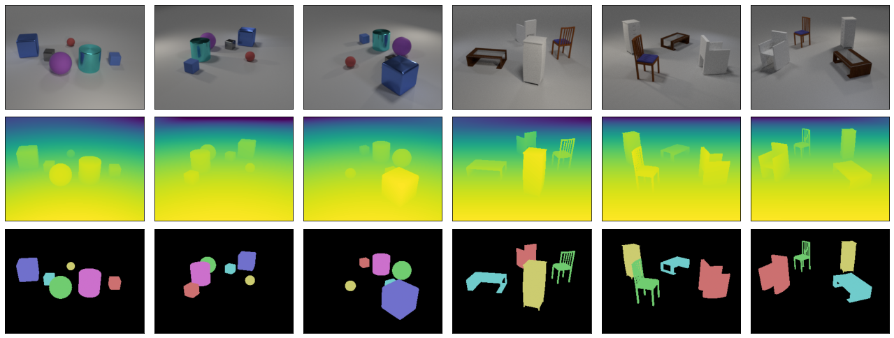

This repository contains code for generating and loading the multi-object 3D datasets introduced for
the [ObSuRF project](https://stelzner.github.io/obsurf/): CLEVR3D and Multishapenet. It conists of
three components: a dataset loader for both datasets, and a generator for each one.



## Loading
The file `loading/dataset.py` contains a PyTorch 1.7 dataset class which may be used to load the datasets. It utilizes the `imageio` package for reading images.

The notebook `loading/data_check.ipynb` loads the data using this class and illustrates it via `matploblib` and `plotly`.

## CLEVR3D Generation

Following the [original code](https://github.com/facebookresearch/clevr-dataset-gen), CLEVR3D is generated using [Blender 2.78c](https://download.blender.org/release/Blender2.78/).
The scene layouts are specified in the metadata file `clevr3d/completed_metadata.npz`.
Based on it, the full dataset may be rendered as follows:
```
cd clevr3d
blender_2-78c --background --python gen_clevr.py -- completed_metadata.npz --use_gpu
--render_images --render_depths --render_masks
```

For additional arguments influencing rendering quality and compute time, check `clevr3d/gen_clevr.py`.

The metadata file was obtained by adding coordinates of cameras and lights to the metadata file of
the original [CLEVR dataset](https://cs.stanford.edu/people/jcjohns/clevr/).
The code for recovering camera locations using Newton's method, resampling light locations, and
adding them to the metadata file is provided in `clevr3d/compute_camera_pos.py` and
`clevr3d/complete_metadata.py`.

## MultiShapeNet Generation

The MultiShapeNet (MSN) dataset is generated based on the [ShapeNet](https://shapenet.org) dataset,
specifically, ShapeNetCore v2. To generate MSN, first place a symlink to the unpacked
ShapeNet data at `msn/data/shapes/shapenetv2`. Then, the dataset may be generated by invoking
`msn/gen_msn.py` using [Blender 2.90.0](https://download.blender.org/release/Blender2.90/).

Unlike CLEVR3D, we generated the metadata file containing the scene descriptions
(`msn/metadata.npz`) from scratch. By default, `msn/gen_msn.py` will sample new scenes and
generate new metadata. To render images for an existing metadata file, use:
```
cd msn
blender_2-90 --background --python gen_msn.py -- --load_metadata metadata.npz
```

For additional options regarding scene parameters, rendering quality, and compute requirements, check
`msn/gen_msn.py`.


## Dataset Specification

Both datasets contain three sets of images, and a metadata file:

* `images/img_{scene_id}_{view_id}.png`: The colored imaged of each scene. 320x240, 8bit RGB `.png`
  files.
* `depths/depths_{scene_id}_{view_id}.png`: 16 bit B/W `.png` files indicating depths.
  __Important__: For CLEVR3D, these indicate the Euclidian distance between the camera and the
  surfaces, whereas for MSN, they represent the camera's z-coordinates. This is due to the
  differences in Blender versions. In either case, the respective value is obtained by converting
  the image values to the range `[0, 1]`, and multiplying by the scaling factor `40.0`. This logic
  is implemented
  [here](https://github.com/stelzner/multi_object_3d_datasets/blob/a2faeeb0307f82c3bee8ede25019be970e18765c/loading/dataset.py#L86).
* `masks/mask_{scene_id}_{view_id}.png`: 8 bit B/W `.png` images providing instance segmentation
  masks. A value of zero represents a pixel which belongs to the background, a positive value
  indicates that it is part of the respective object.
* `metadata.npz`: A Numpy `.npz` file specifying the set of scenes, using the following tensors:
  - `camera_pos [scene_id, view_id, 3]`: The camera positions in world coordinates for each view.
    Each camera is pointed at the origin, with a focal length of `0.035` and a sensor width of
    `0.032`.
  - `light_jitter [scene_id, light_id, 3]`: The noise added to the default locations of the three light sources.
  - `3d_coords [scene_id, object_id, 3]`: The world coordinates of each object's center. Values for
    non-existing objects and the background (`object_id == 0`) are left at zero.
  - Additional object properties follow the same format (`color`, `material`, `pixel_coords`,
    `rotation`, `shape`, `size`, `visibility` for CLEVR3D, `rotation`, `shape`, `shape_file` for
    MSN).


